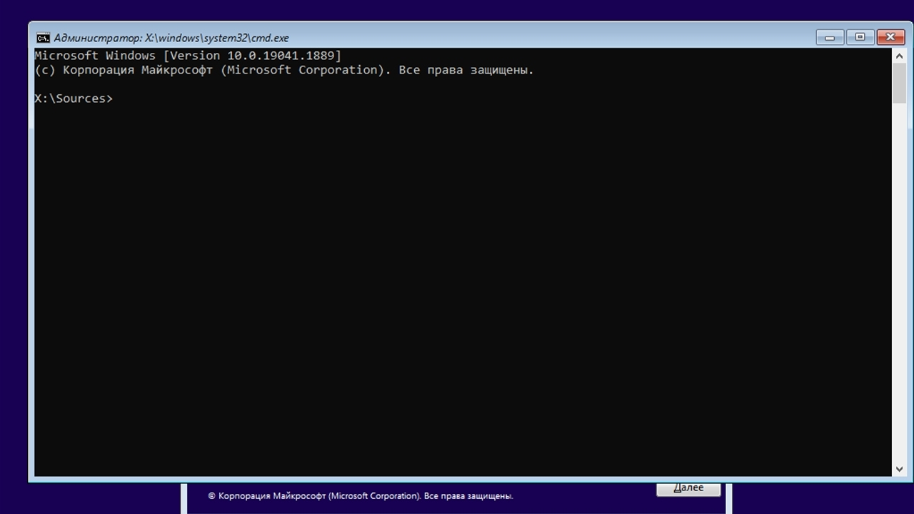

Вы слышали что в Windows нет дыр безопасности? Windows и есть дыра в безопасности. Поэтому если безопасная загрузка отключена, а диски не зашифрованы, это будет слишком просто.



## Используя образ Windows

Берем флешку, заливаем на нее образ Windows. Подойдет любой образ, но если машина выглядит новой то лучше образ по новей и в формате GPT. Лично я советую образ Windows 10.


Но возможно целесообразней будет использовать таблицу разделов в формате MBR.

Большинство новых материнских плат могут читать как GPT так и MBR. Но иногда это требует включения нужной настройки.

В идеале иметь две флешки, одна в GPT, другая в MBR - это в том случае если вам важна отказоустойчивость.

Так сказать, готовы ко всему.


Сделали загрузочную флешку, вставили, загрузились с нее. Нажимаем сочетание клавиш `Shift + F10`. Открылась командная строка:



Далее нужно узнать букву системного диска, проблема в том что она может быть не `C`.

```bash
diskpart # Запустить утилиту Diskpart

lis dis # list disk # Вывести список дисков

sel dis $ # select disk # Выбрать диск, где $ номер диска

det dis # detail disk # Информация о диске
```

Нас интересует **Сведения**, диск должен быть **загрузочным**. Если это так, вероятней всего это системный диск. Несмотря на то, что в информации о другом диске, может быть написано **Системный**.
