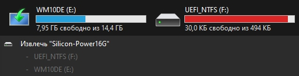
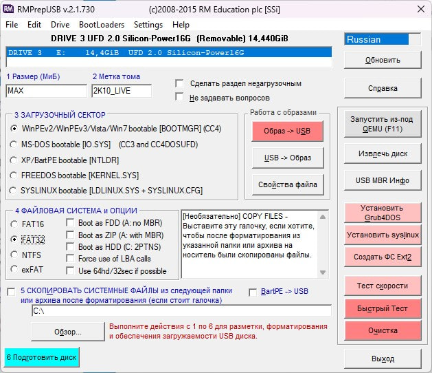
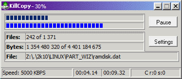
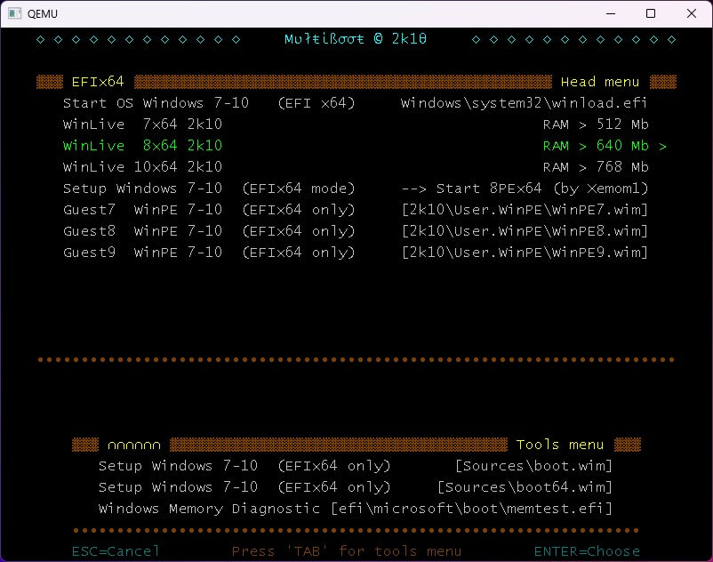

## Подготовка накопителя

Для начала нужно подготовить флешку/диск, если ваш накопитель имеет несколько разделов, и это так не потому что вы так захотели, то их нужно [удалить](https://nozsh.su/blog/udalenie-razdelov-nakopitelia/). Что-то по типу этого:

Если же вы хотите сделать несколько разделов, на одном из которых будет 2k10 Live, то его нужно делать первым:



Я буду использовать флешку. Но вы можете использовать как внешний SDD, так и внешний HDD.

В идеале отформатировать флешку в **FAT32**, но вы не сможете этого сделать (законным путем на Windows) если у вас флешка объемом более 32гб. Так же из-за ограничений **FAT32**, вы не сможете копировать на флешку файлы больше 4гб. А копировать файлы весом больше 4гб нужно, если вы планируете устанавливать большие дистрибутивы ОС с флешки.

Форматировать флешку в **FAT32** нужно из-за огромной совместимости со старым железом. Но это можно упустить и отформатировать в **NTFS**. Можно было бы отформатировать в **exFAT**, это тот же **FAT32**, но без ограничений. Но с **exFAT** большинство старого железа не совместима, в отличии от **NTFS**.

## Запись 2k10 Live на флешку

И так, я буду показывать на 2k10 Live 7.37 Unofficial. У меня есть флешка на 16гб отформатированная в NTFS которую я отформатирую в **FAT32**.


Так же, касается только флешек. В конце "пути" вы можете столкнуться с проблемой, 2k10 Live не будет загружаться, так как система не сможет найти с чего загружаться.

Поэтому лучше все же использовать **FAT32** и отформатировать флешку используя **RMPrepUSB**.

Это можно пропустить если у вас SSD/HDD в NTFS.



Распаковываем образ 2k10 Live с помощью 7z. И запускаем утилиту **RMPrepUSB** из `\2k10\Programs-2k10\Flash-Utilites\RMPrepUSB\`.

Проверяем чтобы флешка была выбрана верно, загрузочный сектор и файловая система была как на скриншоте выше.

Нажимаем **Подготовить диск**.

Если вы получаете ошибку "Отказано в доступе", сначала вручную отформатируйте флешку через проводник.

Дожидаемся окончания, закрываем программу, извлекаем флешку и подключаем снова.


Запускаем утилиту **UTmake**, которая идет в комплекте с 2k10 Live. Если по какой-то причине UTMake не была скачена с ISO образом, запускаем ее из распакованного образа - `\2k10\Programs-2k10\Flash-Utilites\UTmake\`.



Выбираете другой накопитель, если программа выбрала его не правильно.

Если вы используете не флешку, а SSD/HDD диск, выбирайте **USB-Hdd**.

Далее нажимаем **Copy**, чтобы скопировать содержимое ISO образа на флешку.


Если кнопка **Copy** недоступна - переключите UFD/USB-Hdd туда и обратно.


После завершения копирования, выбираем загрузчик в секции **Select loader** и нажимаем на **Setup**, если кнопки доступны. Я советую поставить **Syslinux** или оставить по умолчанию - **Bootmgr**.

Если кнопки недоступны, то просто пропускаем это и идем дальше. Но если, все же это так, то вероятней всего ничего работать не будет и стоит отформатировать флешку с помощью **RMPrepUSB**.

Вы можете нажать на **Test Disk**, чтобы посмотреть работает или нет. Если вы не устанавливали загрузчик то вы особо ничего не увидите, а если устанавливали, то что-то произойдет:

В моем случае работал только режим **UEFI**, то есть **EFIx64** и **EFIx32**. Режим **Legacy** не работал.

UTMake можно закрыть.

## Установка загрузчика

Загрузчик можно не устанавливать, если у вас уже все работает, но лучше в любом случае это сделать, независимо от предыдущего шага.

Далее **ВАЖНО**! Не перепутайте, вы должны в корне вашего накопителя открыть **SetLDR-2k10** из `\2k10\`. То есть это нужно делать НА накопители, а не из папки откуда вы изначально запускали UTMake и где лежит образ!



Выбираем загрузчик который вам больше нравится, но я опять таки советую **Syslinux**, с ним будет большая совместимость со старым железом. Нажимаем **Setup**. Если **Syslinux** недоступен, то ставьте **Grub4Dos**.

Можно снова запустить UTMake и нажать на "Test Disk", чтобы проверить как работает. После того как я установил загрузчик Grub4Dos, у меня заработал Legacy режим.

Если вы хотите быть точно уверены, что все работает, перезагрузитесь с этой флешки, или одолжите ПК у друга.


Так же, если вы все делали в файловой системе NTFS, то вероятней всего загрузка UEFI работать не будет. Но это не столь критично, так как обычно новые материнские платы поддерживают Legacy, но иногда это нужно включить в настройках.


## Дополнения

Содержимое архивов **2k10 Addons.zip** и **2k10 PMAGIC.zip** нужно распаковать в корень флешки.

## Свои дистрибутивы систем

Дистрибутивы Linux должны находиться в `\2k10\User.Image\*`, а Windows в `\2k10\User.WindS\*`.